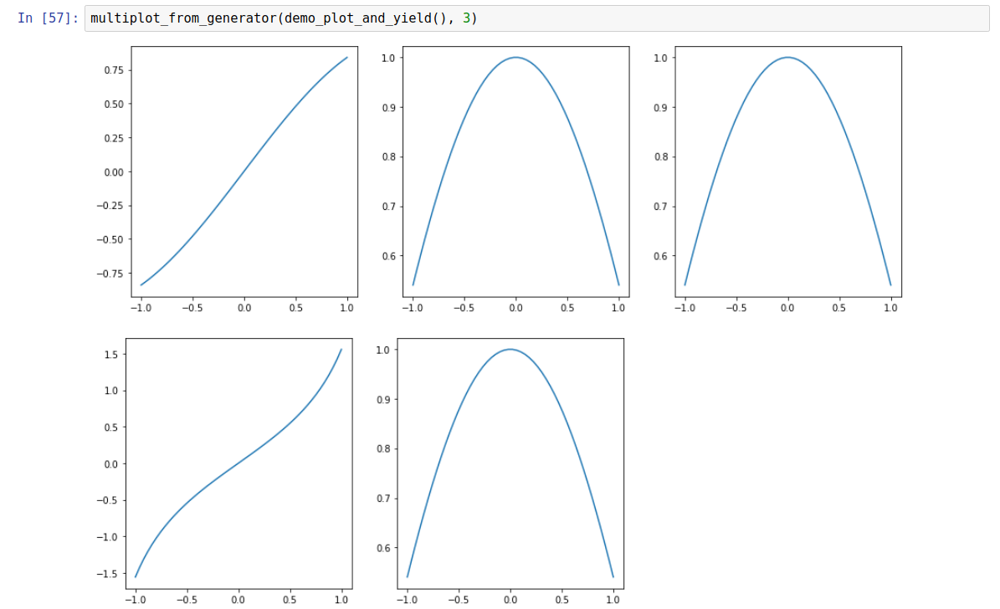

<style type="text/css">
body{ font-size: 16px; }
</style>

&nbsp;

<div style="border:1px solid black ; text-align:center">

# [Aaron McDaid](https://aaronmcdaid.github.io/)

Statistics and Python and C++, and other fun projects

`aaron.mcdaid@gmail.com`

[`@aaronmcdaid`](https://twitter.com/aaronmcdaid)
</div>

# &nbsp;

<div style="text-align:right">
***by [Aaron](https://aaronmcdaid.github.io/), `r params$publication_date`***


[(code for this document)](index.Rmd)
</div>

```{r setup, echo=FALSE}
library(knitr)
knitr::opts_chunk$set(engine.path = list(python = '/usr/bin/python3.6'))
```

# &nbsp;


When searching online for how to do multiple plots in a Python Jupyter notebook, you often
get are told to write code like this (["Multiple subplots"](https://matplotlib.org/gallery/subplots_axes_and_figures/subplot.html)):

```{python}
import matplotlib
import numpy as np
import matplotlib.pyplot as plt
```
```{python, dpi=50, fig.width=6, fig.height=4, fig.align='center'}
xs = np.linspace(-1, 1)
plt.subplot(2,2,1)
plt.plot(xs, np.sin(xs))
plt.subplot(2,2,2)
plt.plot(xs, np.cos(xs))
plt.subplot(2,2,3)
plt.plot(xs, np.tan(xs))
plt.show()
```

This works well. However, I find this difficult for a number of reasons. It requires you know the number of items in advance
and it is necessary to manually keep track of the coordinates, making the correct call to `subplot` each time.
Also, it mixes up your plotting code with this subplot-management code.

So instead, here is a simple trick to allow you to specify all your plots, separated by `yield`:

```{python, eval=F}
def demo_plot_and_yield():
    xs = np.linspace(-1, 1)
    # Put a 'yield' before every subplot, including the first one:
    yield
    plt.plot(xs, np.sin(xs))
    yield
    plt.plot(xs, np.cos(xs))
    yield
    plt.plot(xs, np.cos(xs))
    yield
    plt.plot(xs, np.tan(xs))
    yield
    plt.plot(xs, np.cos(xs))
```

***Note: There must be a `yield` before every plot, _including the first one_.***

Then you can send that function to `multiplot_from_generator` (defined below) along
with the desired number of columns (in this case `3`):

```{python, eval=F}
multiplot_from_generator(demo_plot_and_yield(), 3)
```

Here is the result in Jupyter:



## How to enable it

You simply need to define the `multiplot_from_generator` function as follows.
Note the `figsize` parameter, which you might override if you don't like
the default. By default, the width of one row is 15 "inches" as this seems
to be the width of a Jupyter notebook. Also, by default the subplots are
square; we do this by setting the height to `15/num_columns`:

```{python, eval=F}
def multiplot_from_generator(g, num_columns, figsize_for_one_row=None):
    # call 'next(g)' to get past the first 'yield'
    next(g)

    # default to 15-inch rows, with square subplots
    if figsize_for_one_row is None:
        figsize_for_one_row = (15, 15/num_columns)

    try:
        while True:
            # call plt.figure once per row
            plt.figure(figsize=figsize_for_one_row)
            for col in range(num_columns):
                ax = plt.subplot(1, num_columns, col+1)
                next(g)
    except StopIteration:
        pass
```

## How it works

`multiplot_from_generator` sets up the rows and columns in a loop
and then calls `next(g)` each time in order to force the next
piece of plotting code in the generator to be executed.

`next(g)` causes the generator to run until the next `yield`.

I did try a different design where the `yield` was required after (not before)
each subplot. But that ran into difficulties where I needed to delete
the last subplot. So this design, with the `yield` in front` works better.

&nbsp;

Thanks for making it this far! I'd love feedback, see my Twitter handle and my email address at the top of the page.

&nbsp;

&nbsp;
<div style="text-align:right">
***by [Aaron](https://aaronmcdaid.github.io/), `r params$publication_date`***
</div>

<div id="disqus_thread"></div>
<script type="text/javascript">
    /* * * CONFIGURATION VARIABLES: EDIT BEFORE PASTING INTO YOUR WEBPAGE * * */
    var disqus_shortname = 'aaron-mcdaid'; // required: replace example with your forum shortname
    /* * * DON'T EDIT BELOW THIS LINE * * */
    (function() {
        var dsq = document.createElement('script'); dsq.type = 'text/javascript'; dsq.async = true;
        dsq.src = '//' + disqus_shortname + '.disqus.com/embed.js';
        (document.getElementsByTagName('head')[0] || document.getElementsByTagName('body')[0]).appendChild(dsq);
    })();
</script>
<noscript>Please enable JavaScript to view the <a href="http://disqus.com/?ref_noscript">comments powered by Disqus.</a></noscript>
